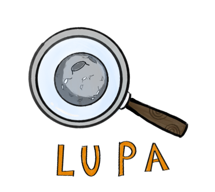
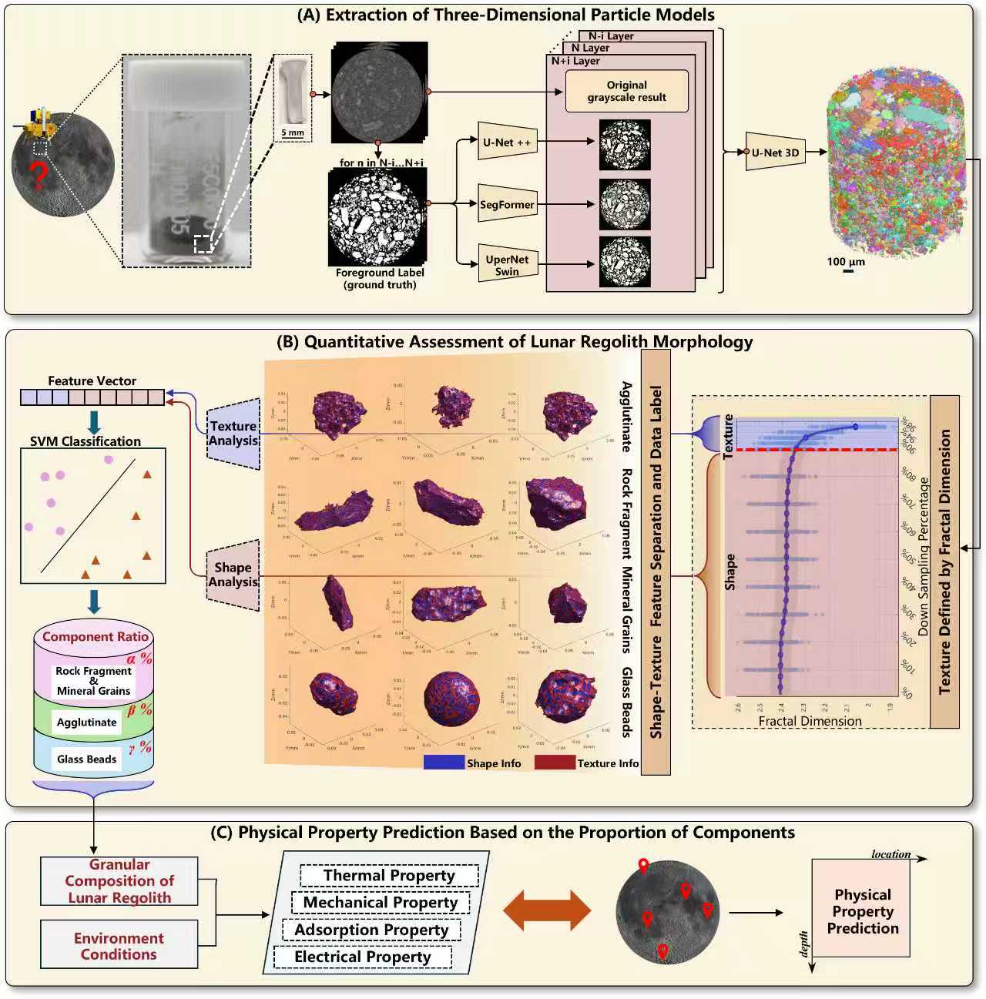
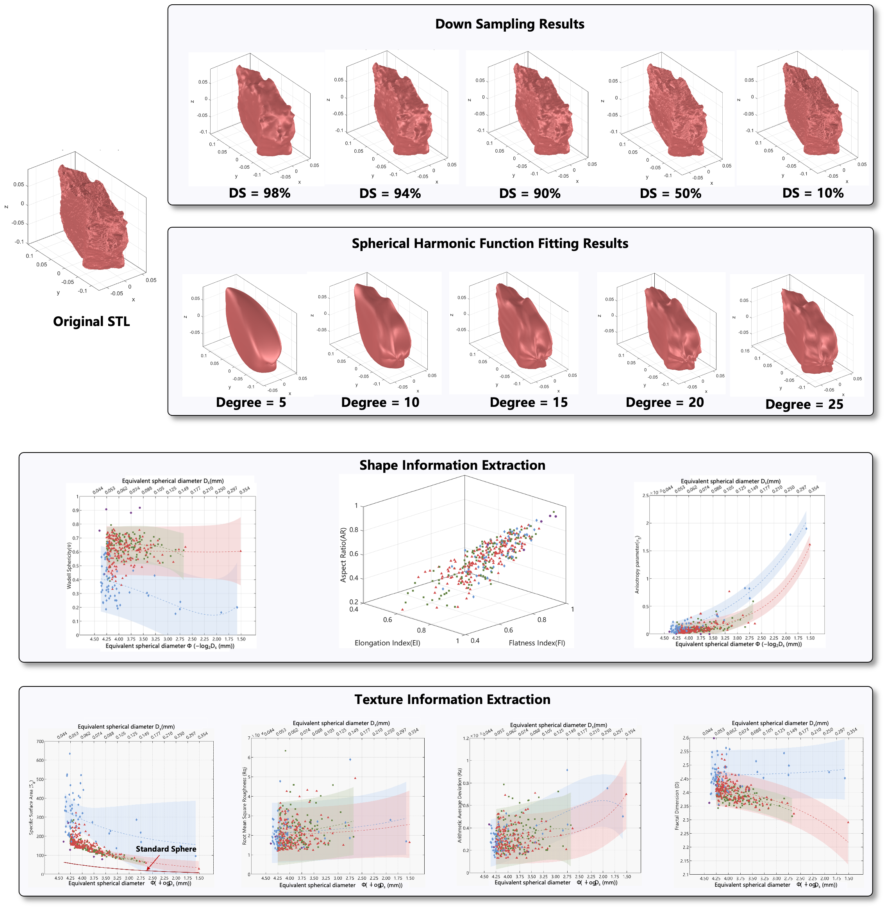

# LUPA: Lunar Regolith Particle Analyzer

**LUPA** is a computational toolkit designed for the **batch and quantitative analysis of lunar regolith particle morphology**. 

**Coming soon:** the full codebase will be released after the paper is published.

<!-- PROJECT SHIELDS -->

[![Contributors][contributors-shield]][contributors-url]
[![Forks][forks-shield]][forks-url]
[![Stargazers][stars-shield]][stars-url]
[![Issues][issues-shield]][issues-url]
[![MIT License][license-shield]][license-url]

<!-- PROJECT LOGO -->
<br />

<p align="center">
  <a href="https://github.com/Catsup0059/LunarRegolithParticleAnalysis/tree/HPC_hit">
    
  </a>

  <h3 align="center">LUPA：Lunar Regolith Particle Analyzer </h3>
  <p align="center">
    <br />
    <a href="https://github.com/shaojintian/Best_README_template"><strong>
</p>


 
## Contents

- [Overview](#Overview)
- [Installation](#Installation)
- [Inplementations](#Inplementations)
- [Results](#Results)
- [Contributors](#Contributors)
- [License](#License)
- [Aknowledgements](#Aknowledgements)

## Overview
Lunar regolith particle morphology strongly influences the mechanical and thermal properties of the lunar surface. Existing studies are still largely based on qualitative observations or rely on closed commercial software, which limits transparency, reproducibility, and large-scale statistical analysis.

LUPA is a computational toolkit for the batch analysis of CT-derived lunar regolith particles. It establishes a quantitative characterization framework that evaluates particles from two complementary aspects: morphology and surface texture.

Preprocessing Module
- Mesh repair to remove internal pore structures captured by CT scanning
- Point cloud filtering and downsampling for efficient computation
- Generation of clean particle geometry for analysis

Quantitative Analysis Module
- Extraction of morphological descriptors (global shape features)
- Extraction of texture descriptors (surface roughness and micro-structure)
- Support for statistical analysis of large particle populations

Classification Module
- Based on the extracted morphological features, LUPA incorporates an SVM-based classifier to distinguish particle types.

The toolkit not only offers efficient and reproducible large-scale analysis, but also provides a quantitative basis for interpreting regolith formation processes, space weathering, and maturity through particle-type proportions, thereby enhancing the understanding of how particle composition influences macroscopic physical properties.
  <p align="center">
    
  </p>
</a>


## Installation

### 1. Get Code
```sh
git clone https://github.com/Catsup0059/LunarRegolithParticleAnalysis.git
```
### 2. Environment Preparation 

```sh
# create conda env for LUPA
conda create -n lupa python=3.12.7
conda activate lupa
# install pymeshlab
pip install pymeshlab
```

## Inplementations

### 1. Prepare Input Data
Place all particles STL files to be analyzed in the directory:
```sh
data/stl/original_stl
```
Each STL file should represent a single particle reconstructed from CT data.

### 2. Configure Parameters
The analysis parameters are defined in the configuration file analysis.ini.
Users are encouraged to modify parameters in this file rather than editing the  source code directly. Key parameters typically include:

• Output directory for saving analysis results

• Point cloud downsampling ratio used during preprocessing

• Other analysis-related settings

### 3. Run the Main Program
The entry point of the toolkit is `main.m`. Before running the program:

• Set the absolute path of the project root directory in the script.

• Configure the MATLAB parallel pool according to the available computational resources.

### 4. Excute Analysis
After the Configuration is completed, run:
```sh
main
```
The program will automatically process all STL files in the input directory, perform preprocessing, and extract particle morphology and surface texture descriptors.
All analysis results will be saved in:
```sh
data/result
```

## Result
 Representative results are provided to illustrate the capabilities of the toolkit. First, STL models reconstructed from particle scans are visualized as the input geometry for subsequent analysis. The effects of mesh simplification are demonstrated through different levels of STL downsampling, showing the trade-off between geometric detail and computational efficiency. In addition, spherical harmonic fitting with different harmonic orders is applied to the particle surfaces, illustrating how higher orders progressively capture finer geometric features.

Beyond single-particle examples, the toolkit is applied to several hundred particles segmented from CT data. Using the developed algorithms, texture features and morphological descriptors are automatically extracted and statistically summarized, providing quantitative insights into particle surface characteristics and shape distributions across the dataset.

Furthermore, based on the extracted morphological features, a support vector machine (SVM) classifier is employed to categorize particles into genetic types. Considering the high morphological similarity between monomineral grains and lithic fragments, these two categories are merged into a single class, resulting in three effective classes: glass, agglutinates, and mineral/lithic particles. The classification results demonstrate clear separability in the multidimensional feature space, and the overall classification accuracy exceeds 94%. This outcome further validates the effectiveness of the proposed quantitative descriptors and highlights the capability of the toolkit to support data-driven particle classification and origin analysis.
 
  <p align="center">
    
  </p>
</a>


## Contributors

For contributors to this toolkit, please refer to the contributors list on the right side of the repository page.


## License

This project is licensed under the GNU Affero General Public License v3.0.

You may redistribute and modify this software under the terms of the
AGPL-3.0 license as published by the Free Software Foundation.

If you use this software in a network service, you must provide users
access to the corresponding source code as required by AGPL-3.0.

See the LICENSE file for the full license text. [LICENSE.txt](https://github.com/Catsup0059/LunarRegolithParticleAnalysis/blob/main/license/LICENSE)

## Aknowledgements
This project incorporates functionality from the Spherical Harmonic Modeling and Analysis Toolkit(SPHARM-MAT-v1-0-0), developed by ShenLab, Center for Neuroimaging, Indiana University. We gratefully acknowledge the efforts of the original developers and maintainers of this package. Their work has provided an important foundation for the development of this project.

The original source code and license of the package are preserved in this repository in accordance with the GNU Affero General Public License v3.0. We sincerely thank the authors for releasing their work as open-source software and supporting the advancement of the research community.


<!-- links -->
[your-project-path]:shaojintian/Best_README_template
[contributors-shield]: https://img.shields.io/github/contributors/Catsup0059/LunarRegolithParticleAnalysis.svg?style=flat-square
[contributors-url]: https://github.com/Catsup0059/LunarRegolithParticleAnalysis/graphs/contributors

[forks-shield]: https://img.shields.io/github/forks/Catsup0059/LunarRegolithParticleAnalysis.svg?style=flat-square
[forks-url]: https://github.com/Catsup0059/LunarRegolithParticleAnalysis/network/members

[stars-shield]: https://img.shields.io/github/stars/Catsup0059/LunarRegolithParticleAnalysis.svg?style=flat-square
[stars-url]: https://github.com/Catsup0059/LunarRegolithParticleAnalysis/stargazers

[issues-shield]: https://img.shields.io/github/issues/Catsup0059/LunarRegolithParticleAnalysis.svg?style=flat-square
[issues-url]: https://github.com/Catsup0059/LunarRegolithParticleAnalysis/issues

[license-shield]: https://img.shields.io/github/license/Catsup0059/LunarRegolithParticleAnalysis.svg?style=flat-square
[license-url]: https://github.com/Catsup0059/LunarRegolithParticleAnalysis/blob/HPC_hit/LICENSE.txt
